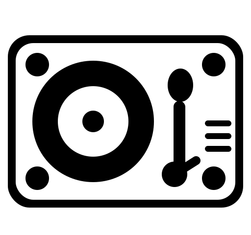

<div align="center">
  
  
  # Soundfeed 
  
  Follow artists *you* want to hear
  
  [](https://opensource.org/licenses/MIT)
  [](https://dotnet.microsoft.com/)
  [](https://react.dev/)
  [](https://www.postgresql.org/)
  [](https://redis.io/)
  [](https://www.react.doctor/share?p=frontend&s=94&e=1&w=15&f=6)
</div>

## About

Soundfeed tracks your favorite Spotify artists and displays new releases in a clean, chronological feed.

No login, account or any personal detail required.

## Features

- **Subscribe to Spotify artists**
  - Subscribe to artists by pasting searching or pasting their Spotify URL
  - Unsubcribe from artists
- **Sync existing account**
  - Recover your feed using a recovery code
- **Manage your feed**
  - Trigger manual sync
  - Dismiss already seen feed entries
  - Order and navigate in your feed

## Project Structure

```
Soundfeed/
├── frontend/
│   └── src/
│       ├── api/
│       ├── assets/              # Images and static assets
│       ├── components/          # React components
│       │   └── layout/          # Layout components
│       ├── contexts/            # React Context providers
│       ├── hooks/               # Custom React hooks
│       ├── pages/               # Page components
│       ├── styles/              # Shared Tailwind constants
│       ├── types/               # TypeScript type definitions
|       └── utils/               # Utility functions
│
└── backend/
    ├── Soundfeed.Api/           # API layer
    │   ├── Controllers/         # REST API endpoints
    │   ├── Middlewares/         # Request/response middleware
    │   └── Extensions/          # Service configuration
    │
    ├── Soundfeed.Bll/          # Business logic layer
    │   ├── Features/           # Domain separated features
    │   │   ├── Artist/
    │   │   ├── ....
    │   ├── Services/           # Business services
    │   ├── Jobs/               # Background jobs
    │   └── Models/             # DTOs and response models
    │
    └── Soundfeed.Dal/          # Data access layer
        ├── Entities/           # Entities
        ├── Contexts/           # DbContext and abstractions
        └── Migrations/         # Database migrations
```

## Getting Started

Contributions are welcome, please open a pull request based on the latest main branch.

### Prerequisites

- Docker & Docker Compose
- Spotify API credentials

### Quick Start

1. Clone the repository

   ```bash
   git clone <repository-url>
   cd Soundfeed
   ```

2. Create `.env` file
   - Example structure is provided in `.env.example`
   - Get Spotify Client ID and Client Secret [here](https://developer.spotify.com/documentation/web-api)

3. Start services

   ```bash
   docker-compose up -d --build
   ```

4. Access the application
   - Frontend: http://localhost:3000
   - Backend API: http://localhost:8080

## License

This project is licensed under the MIT License - see the [LICENSE](./LICENCE) file for details.
